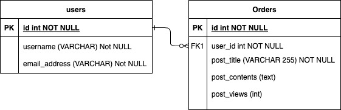

# Two Tables Design Recipe Template

_Copy this recipe template to design and create two related database tables from a specification._

## 1. Extract nouns from the user stories or specification

```
As a social network user,
So I can have my information registered,
I'd like to have a user account with my email address.

As a social network user,
So I can have my information registered,
I'd like to have a user account with my username.

As a social network user,
So I can write on my timeline,
I'd like to create posts associated with my user account.

As a social network user,
So I can write on my timeline,
I'd like each of my posts to have a title and a content.

As a social network user,
So I can know who reads my posts,
I'd like each of my posts to have a number of views.
```

```
Nouns:

user account, email address, username, timeline, post title, post content, post views
```
Actions:
create user, create post, 


## 2. Infer the Table Name and Columns

| Record                | Properties                                                |
| --------------------- | --------------------------------------------------------- |
| users                 | id, username, email_address                               |
| posts                 | id, user_account_id, post_title, post_content, post_views |

1. Name of the first table: `users` 

    Column names: `id`, `username`, `email_address`

2. Name of the second table: `posts` 

    Column names: `id`, `user_id`, `post_title`, `post_content`, `post_views`

## 3. Decide the column types

[Here's a full documentation of PostgreSQL data types](https://www.postgresql.org/docs/current/datatype.html).

```
# EXAMPLE:

Table: user_account
id: SERIAL
username: text
email_address: text

Table: posts
id: SERIAL
user_id: int (foreign key)
post_title: text
post_contents: text
post_views: int

```

## 4. Decide on The Tables Relationship

```
1. Can one user have many posts? YES
2. Can one post have many users? NO

-> Therefore,
-> An user HAS MANY posts
-> An post BELONGS TO an users

-> Therefore, the foreign key is on the posts table.
```
see attached diagram:


## 5. Write the SQL

```sql
-- file: social_network_table.sql

CREATE TABLE users (
  id SERIAL PRIMARY KEY,
  username VARCHAR (50),
  email_address VARCHAR (255)
);

CREATE TABLE posts (
  id SERIAL PRIMARY KEY,
  post_title VARCHAR (255),
  post_contents text,
  post_views int,
  user_id int,
  constraint fk_user foreign key(user_id)
    references users(id)
    on delete cascade
);

```

## 6. Create the tables

```bash
psql -h 127.0.0.1 database_name < albums_table.sql
```